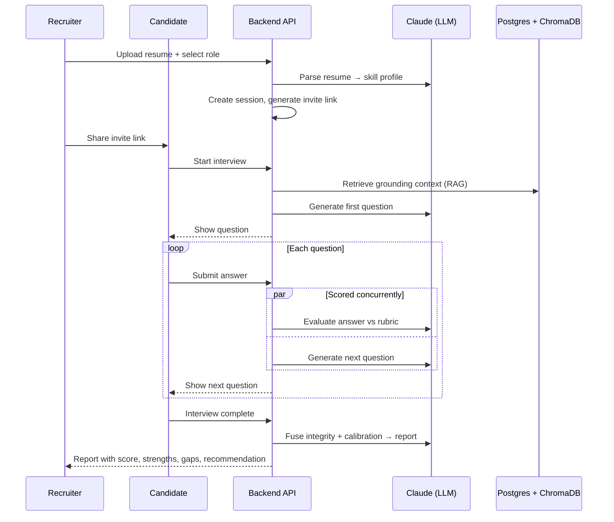

# CritiQ — AI-Powered Role-Based Candidate Screening System

**Author:** Maithili Dorkhande ([@maithili39](https://github.com/maithili39))
**Affiliation:** St. Vincent Pallotti College of Engineering and Technology, Nagpur
**Date:** July 2026

---

## Abstract

CritiQ is an AI-powered platform that conducts a complete technical screening
interview from end to end. A recruiter uploads a candidate's resume and selects a
target role; the system parses the resume, generates interview questions one at a
time from a role-specific knowledge base grounded through Retrieval-Augmented
Generation (RAG), scores each answer as it is submitted, and produces a structured
hiring report with a recommendation. Candidates complete the interview themselves
through a shareable, token-authenticated invite link with no account required. The
questioning is adaptive — each question can go deeper on strong answers or fall back
to fundamentals on weak ones — and every question is traceable to the source chunks
it was grounded in. The backend is built with FastAPI and PostgreSQL, uses ChromaDB
with sentence-transformer embeddings for vector retrieval, and calls Anthropic Claude
(with Groq as an alternate provider) using tool-use for guaranteed structured output.
A rubric-based scoring model, integrity/anti-cheating signals, and hiring-outcome
calibration convert raw answer evaluations into a defensible recommendation. The
system separates recruiter and candidate views so scores, rationale, and reports
remain confidential to the recruiter. The result is a reproducible, auditable, and
role-aware screening pipeline that reduces manual effort in early-stage technical
hiring while grounding its questions in authoritative source material rather than
model memory alone.

---

## Introduction

Technical hiring is time-consuming and inconsistent: early-stage screening interviews
are repetitive for recruiters, hard to standardize across candidates, and often rely
on questions drawn from an interviewer's memory rather than a defined body of
knowledge. This creates bias, uneven difficulty, and poor traceability of why a given
candidate was advanced or rejected.

CritiQ addresses this by automating the screening interview while keeping it grounded,
adaptive, and auditable. The objectives of the project are: (1) to parse candidate
resumes into structured skill profiles; (2) to generate role-relevant questions from a
curated knowledge base rather than unconstrained model output; (3) to score answers
consistently against an explicit rubric; and (4) to produce a transparent, evidence-
backed hiring recommendation. The problem is important because fair, scalable, and
explainable candidate evaluation directly affects both hiring quality and candidate
experience.

---

## Literature Review

Large Language Models (LLMs) such as Anthropic Claude and OpenAI GPT have demonstrated
strong performance on open-ended reasoning and evaluation tasks, but they are prone to
hallucination when asked to generate domain-specific content from parametric memory
alone. Retrieval-Augmented Generation (Lewis et al., 2020) mitigates this by grounding
generation in retrieved documents, improving factual accuracy and traceability. Dense
retrieval using sentence-transformer embeddings (Reimers & Gurevych, 2019) enables
semantic matching between candidate profiles and knowledge-base content. Vector stores
such as ChromaDB provide efficient nearest-neighbour search over these embeddings.
Prior automated-interview and resume-screening systems largely rely on keyword matching
or opaque classifiers, which offer limited explainability and can encode bias. CritiQ
builds on the RAG paradigm and structured tool-use output to deliver questions and
scores that are both grounded and auditable.

---

## Methodology

A recruiter uploads a resume, which Claude parses into skills, technologies, and an
experience level. A retrieval query is built from that profile plus the selected role
and steered away from already-covered topics; ChromaDB returns grounding chunks from
role-specific textbooks. Claude generates one question at a time from those chunks.
Each submitted answer is scored immediately against a rubric — producing a score,
rationale, strengths, and gaps — while the next question is generated concurrently. A
session state machine (`created → active → completed`) governs the flow. On completion,
integrity signals and outcome calibration are fused into a final structured hiring
report.



---

## Implementation

**Programming languages:** Python (backend), TypeScript (frontend).

**Frameworks / libraries:**
- Backend: FastAPI, SQLAlchemy, Alembic, Pydantic, slowapi.
- Frontend: React 19, React Router, Vite, Tailwind CSS.
- AI / RAG: Anthropic Claude SDK (Groq alternate), sentence-transformers, ChromaDB.
- PDF parsing: PyMuPDF.

**Tools used:**
- Database: PostgreSQL; caching / rate limiting: Redis.
- Vector store: ChromaDB (persistent disk).
- Testing: Pytest (backend), Vitest + React Testing Library (frontend).
- CI/CD: GitHub Actions; deployment via Docker Compose and Render (`render.yaml`);
  frontend on Vercel/Netlify.

**Repository layout:**
```
frontend/  React app — pages, components, context, typed API client
backend/   FastAPI app — api/, services/, rag/, models/, alembic/, tests/
           knowledge_base/  role-specific PDFs used as the RAG corpus
```

---

## Results and Discussion

The system runs a full interview loop end to end: resume parse → adaptive question
generation → live per-answer scoring → structured hiring report with a strong-yes /
yes / maybe / no recommendation. Key outcomes:

- **Grounded questioning:** every question stores the exact retrieved context it was
  generated from, giving full traceability from question back to source chunks.
- **Structured output:** all LLM calls use forced tool-use, so responses are schema-
  guaranteed rather than parsed from free text.
- **Adaptive difficulty:** later questions deepen on strong answers or revert to
  fundamentals on weak ones.
- **Verification:** the backend Pytest suite and the frontend Vitest suite both pass,
  the production build type-checks cleanly, and linting passes with zero warnings.

Concurrent scoring and next-question generation keep per-turn latency low, and the
recruiter/candidate view separation ensures scores and reports stay confidential.

---

## Why Not Just Use ChatGPT?

A general-purpose chatbot can be prompted to "interview" a candidate, but it cannot be a
hiring *system*. CritiQ differs on properties a chat interface fundamentally lacks:

| Capability | General LLM chat | CritiQ |
|---|---|---|
| Question grounding | Parametric memory (can hallucinate) | RAG over curated role textbooks; every question stores its source chunks |
| Scoring consistency | Drifts between sessions and phrasings | Fixed per-role rubric with deterministic weighted aggregation |
| Bias mitigation | Sees the full resume, name and all | **Demographic-blind screening**: PII and demographic markers are redacted before the model ever sees the resume |
| Integrity | No notion of cheating | Deterministic session-level fusion of paste/tab/timing signals with explainable deductions |
| Learning from outcomes | Stateless | Recruiter-recorded hiring outcomes are correlated against predicted scores (Pearson, precision/recall) to calibrate the system on private, accumulated data |
| Confidentiality | One shared transcript | Two-sided flow: candidates never see scores, rationale, or reports |
| Auditability | Ephemeral chat | Postgres-persisted sessions, answers, grounding context, and structured reports |

In short, the LLM is one *component* — the grounding, rubric, redaction, integrity fusion,
and outcome calibration around it are what make the evaluation defensible.

---

## Limitations

- Question quality is bounded by the coverage of the ingested knowledge-base PDFs.
- LLM-based scoring can still vary and may reflect model biases despite the rubric.
- Anti-cheating/integrity signals reduce but cannot fully eliminate assisted answers.
- The current knowledge base focuses on AI/ML and data-science roles.
- Interviews are text-based; no live coding, voice, or video assessment yet.

---

## Future Scope

- Expand the knowledge base to more roles and domains.
- Add live coding, voice, and video interview modalities.
- Introduce human-in-the-loop review and richer bias/fairness auditing.
- Support multilingual interviews and stronger proctoring signals.
- Provide analytics dashboards comparing candidates and calibrating against outcomes.

---

## Conclusion

CritiQ demonstrates a reproducible, role-aware, and auditable approach to automated
technical screening. By combining RAG grounding, structured tool-use output, rubric-
based scoring, and outcome calibration, it produces adaptive interviews and defensible
hiring recommendations while keeping every question traceable to its source. The
contribution is an end-to-end, two-sided screening pipeline that reduces manual
recruiter effort without sacrificing transparency or grounding.

---

## References

[1] P. Lewis, E. Perez, A. Piktus, F. Petroni, V. Karpukhin, N. Goyal, H. Küttler,
M. Lewis, W. Yih, T. Rocktäschel, S. Riedel, and D. Kiela, "Retrieval-augmented
generation for knowledge-intensive NLP tasks," in *Proc. 34th Int. Conf. Neural Inf.
Process. Syst. (NeurIPS)*, Vancouver, Canada, 2020, pp. 9459–9474.

[2] N. Reimers and I. Gurevych, "Sentence-BERT: Sentence embeddings using Siamese
BERT-networks," in *Proc. Conf. Empirical Methods Natural Lang. Process. (EMNLP-IJCNLP)*,
Hong Kong, 2019, pp. 3982–3992.

[3] A. Vaswani, N. Shazeer, N. Parmar, J. Uszkoreit, L. Jones, A. N. Gomez, Ł. Kaiser,
and I. Polosukhin, "Attention is all you need," in *Proc. 31st Int. Conf. Neural Inf.
Process. Syst. (NeurIPS)*, Long Beach, CA, USA, 2017, pp. 5998–6008.

[4] Anthropic, "Claude API documentation." Accessed: Jul. 2026. [Online]. Available:
https://docs.anthropic.com

[5] Chroma, "ChromaDB: The AI-native open-source embedding database." Accessed:
Jul. 2026. [Online]. Available: https://www.trychroma.com

[6] Sebastián Ramírez, "FastAPI documentation." Accessed: Jul. 2026. [Online].
Available: https://fastapi.tiangolo.com
