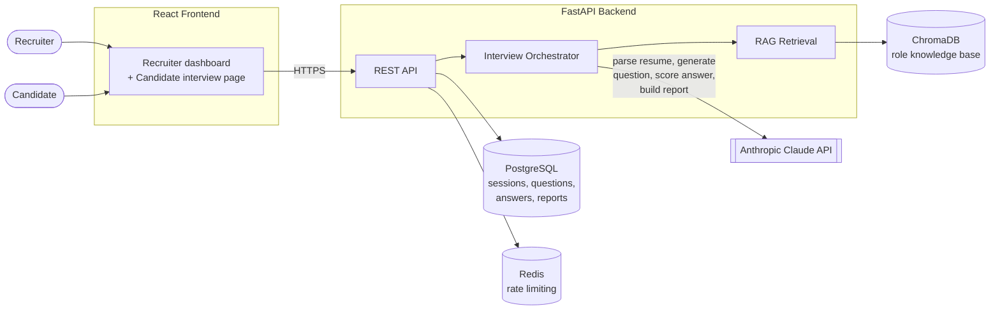
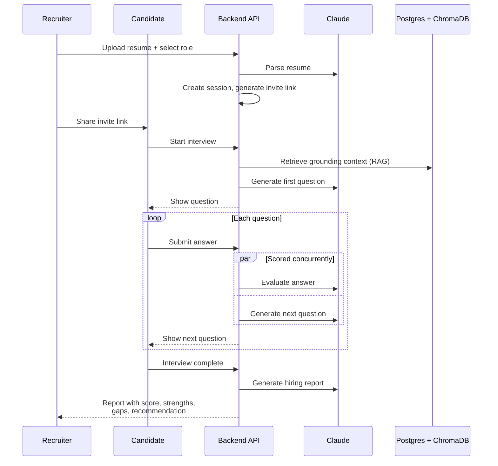

# CritiQ — AI-Powered Candidate Screening

CritiQ runs a full technical screening interview end to end: a recruiter uploads a
candidate's resume and picks a role, the system parses it, generates interview questions
one at a time from a role-specific knowledge base (grounded via RAG, not just the model's
memory), scores each answer as it comes in, and produces a structured hiring report at the
end. Candidates can complete the interview themselves through a shareable invite link —
no account required on their side.

## Features

- **Resume parsing** — PDF upload → text extraction → Claude extracts skills,
  technologies, experience level, and a summary.
- **Adaptive, RAG-grounded questions** — each question is retrieved from a role-specific
  knowledge base (ChromaDB + sentence-transformer embeddings) and generated one at a time,
  so later questions can go deeper or fall back to fundamentals based on how the candidate
  answered the previous one.
- **Live answer scoring** — every answer is evaluated immediately with a score, rationale,
  strengths, and gaps.
- **Structured hiring reports** — a final summary, topic-by-topic coverage, and a
  recommendation (strong yes / yes / maybe / no) once the interview is complete.
- **Two-sided recruiter/candidate flow** — a recruiter creates a session and gets a
  shareable invite link; the candidate takes the interview at that link with no account,
  authenticated only by a per-session token. The candidate never sees scores, rationale,
  or the report — those are the recruiter's call to make.
- **Recruiter accounts** — email/password auth, password reset, email verification, and a
  "My Sessions" dashboard of every screening a recruiter has run.

## Tech stack

| Layer | Technology |
|---|---|
| Frontend | React, TypeScript, Vite, Tailwind, React Router |
| Backend | FastAPI, SQLAlchemy, Alembic |
| Database | PostgreSQL |
| Vector store | ChromaDB (sentence-transformers embeddings) |
| Rate limiting | slowapi (Redis-backed at scale) |
| LLM | Anthropic Claude (tool-use for structured output) |
| Testing | Pytest / Vitest + React Testing Library |
| CI | GitHub Actions |

## Architecture



**Interview flow:**



## Repository layout

```
frontend/
  src/pages/         Route-level pages (Home, InterviewSetup, Interview, CandidateInterview, Report...)
  src/components/    Shared UI (Navbar, SiteFooter, ProtectedRoute)
  src/context/       Auth + interview session state
  src/lib/api.ts      Typed fetch client for the backend API

backend/
  app/api/            HTTP routes (sessions, candidate, auth, admin)
  app/services/       Resume parsing, question generation, interview orchestration, Claude client
  app/rag/            Ingestion (PDF -> chunks -> embeddings -> ChromaDB) + retrieval
  app/models/         SQLAlchemy models (sessions, questions, answers, reports, users)
  alembic/            Postgres schema migrations
  knowledge_base/     Role-specific PDFs used as the RAG corpus
  scripts/            Backup/restore scripts
  tests/              Pytest suite
```

## Getting started

### Backend

Requires a running Postgres instance (the quickest way is `docker-compose up postgres`,
or point `DATABASE_URL` at any Postgres you already have).

```bash
cd backend
python -m venv venv && venv\Scripts\activate   # or source venv/bin/activate on macOS/Linux
pip install -r requirements.txt
cp .env.example .env   # fill in ANTHROPIC_API_KEY, DATABASE_URL, and JWT_SECRET
alembic upgrade head          # create the schema
python ingest.py --role all   # ingest knowledge_base PDFs into ChromaDB
uvicorn app.main:app --reload
```

Backend runs on `http://localhost:8000`.

When you change a SQLAlchemy model, generate a new migration with:
```bash
alembic revision --autogenerate -m "describe the change"
alembic upgrade head
```

Run the backend test suite (in-memory SQLite, no live Postgres or Anthropic key needed —
every Claude call is mocked):
```bash
pip install -r requirements-dev.txt
pytest                              # add --cov=app --cov-report=term-missing for coverage
```

### Frontend

```bash
cd frontend
npm install
cp .env.example .env   # VITE_API_URL=http://localhost:8000/api
npm run dev
```

Frontend runs on `http://localhost:3000`. `npm run build` typechecks and produces a static
`dist/` bundle; `npm run preview` serves it locally.

Run the frontend test suite (Vitest + React Testing Library):
```bash
npm run test          # single run
npm run test:watch    # watch mode
```

### Docker

```bash
docker-compose up --build
```

Spins up Postgres, Redis, the backend (auto-runs migrations + knowledge base ingestion on
start), and the frontend together.

## Deployment (Render)

This repository includes a `render.yaml` Blueprint for deploying the backend API to Render.

**What the blueprint provisions:**
The blueprint automatically provisions the full stack required to run the backend:
1. **PostgreSQL database** (free tier)
2. **Redis instance** (free tier) for rate limiting
3. **Backend web service** (starter plan, ~$7/mo) with a persistent disk attached for ChromaDB

**Why the backend requires the Starter plan:**
Render's free tier does not support persistent disks. Without a persistent disk, ChromaDB's
vector store would live on an ephemeral filesystem, forcing the application to re-ingest
all PDFs from scratch on every single cold start (adding 30-60s of startup latency) and
losing the vector index every time the container sleeps.

**Steps to deploy:**
1. Fork or clone this repository to your GitHub account.
2. In the Render dashboard, go to **Blueprints** → **New Blueprint Instance**.
3. Select your repository.
4. Render will prompt you for the required environment variables (e.g., `ANTHROPIC_API_KEY`, `JWT_SECRET`, `ADMIN_API_KEY_HASH`).
5. Click **Apply**. Render will stand up the database, Redis, and backend service, and automatically wire their connection strings together.

**Deploying the frontend:**
The frontend should be deployed separately to a static hosting provider like Vercel or Netlify.
Set the `VITE_API_URL` environment variable in your frontend hosting dashboard to point to
your deployed Render backend URL (e.g., `https://critiq-backend.onrender.com/api`).

## Key design decisions

- **RAG grounding, not hallucinated questions** — every question is generated from chunks
  retrieved from role-specific textbooks, not from the model's parametric knowledge alone.
- **Recursive chunking** (paragraph → sentence → word, 512 chars / 64 overlap) preserves
  semantic boundaries better than fixed-size splitting.
- **Query construction** combines the candidate's parsed skills/technologies/domains with
  the selected role, and steers away from topics already covered earlier in the interview.
- **One question at a time**, not a batch — each question can adapt to the previous answer
  (deeper follow-up on strong answers, fundamentals check on weak ones).
- **Full traceability** — each stored question keeps the exact retrieved context it was
  grounded in, so every question can be traced back to its source chunks.
- **Structured LLM output** — every Claude call uses tool-use with a forced `tool_choice`,
  so responses are guaranteed to match a schema instead of being parsed out of free-form
  text.
- **Candidate-safe API** — the candidate-facing endpoints deliberately omit scores,
  rationale, and the report; that information is the recruiter's to see and decide on.
- **Session state machine** (`created → active → completed`) lives in
  `interview_orchestrator.py` as the single source of truth, independent of the API layer
  so it's testable without HTTP.
